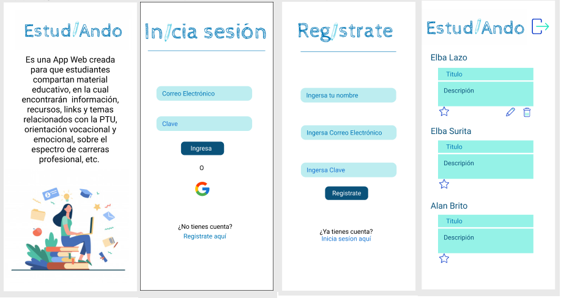
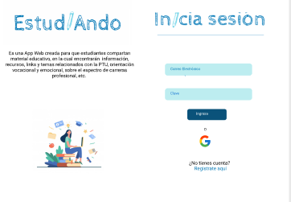
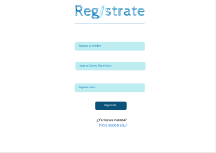
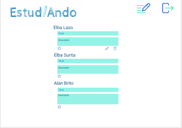
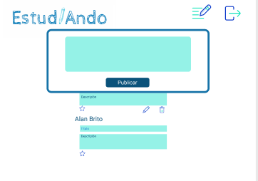
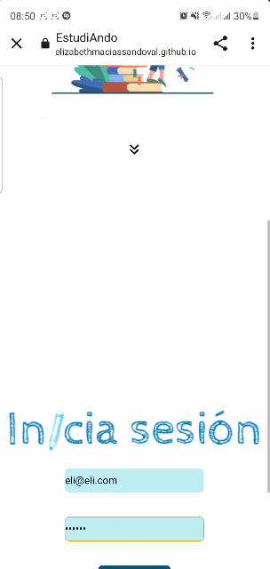

# Creando una Red Social

## Índice

* [1. Estudiando](#1-Estudiando)
* [2. Prototitos](#2-resumen-del-proyecto)
* [3. Historias de usuarios](#3-Historias-de-Usuario)
* [4. Test de usabilidad](#4-Test-de-usabilidad)
* [5. Enlace de la página](#5-Enlace-de-la-página)
* [6. Creado por:](#6-Creado-por:)

## 1. Estudiando

Es una aplicación web destinada tanto a alumnos de 3ero y 4to medio como a profesores, la cuál les otorga interacción a través de publicaciones y dar me gustas a éstas, esta Red Social, tiene como objetivo poder hacer que exista una instancia en donde se pueda compartir informacion, tips y apoyo en el proceso de la PTU.
La app tambien permite que puedas registrarte de 2 maneras , la primera a través de su página principal aprentando el signo de Google, y la otra es ingresando a la pantalla de Registrate, en donde encontrarás la opcion de poner tu nombre de Usuario, asi como un email y contraseña.
Una vez ya realizado alguno de esto pasos podras acceder al muro en donde encontrarás las publicaciones de otras personas y podrás darle "Me Gusta", también al momento de hacer una publicación, sino estas conforme , se te ofrece la funcion de borrarla, haciendo de esta una genial idea si deseas compartir informacion con compañeres o Profesores.

## 2. Prototipos
### Versión Mobile 

### Versión Desktop 

## 3. Historias de Usuarios

## 4. Test de usabilidad 

## 5. Enlace de la página
https://sarariverosolmedo.github.io/SCL018-social-network/src
## 6. Creado por:
_Elizabeth Macías,_  _Karina Hidalgo_ y _Sara Riveros_